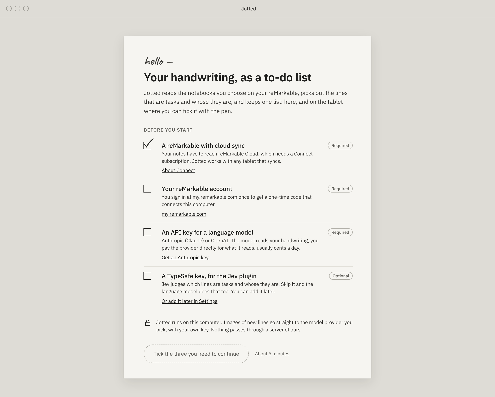
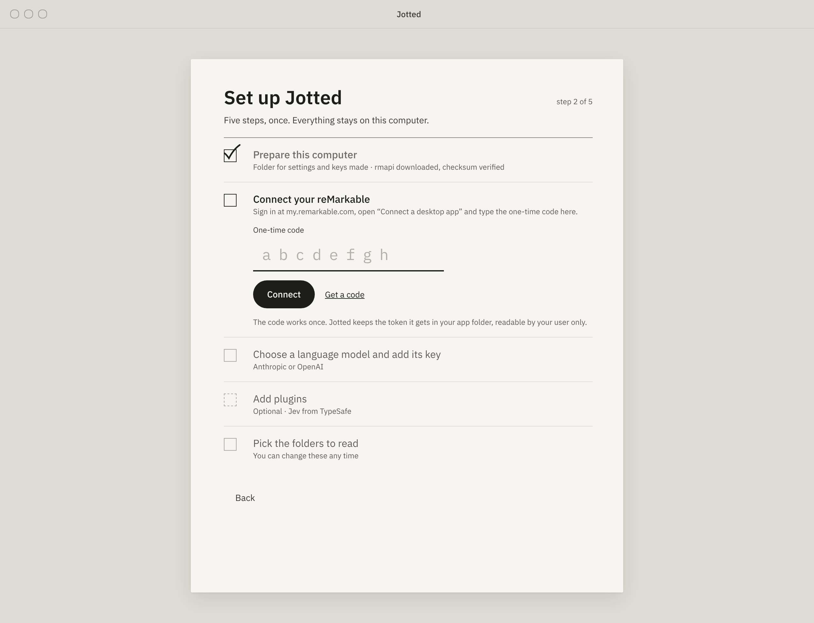
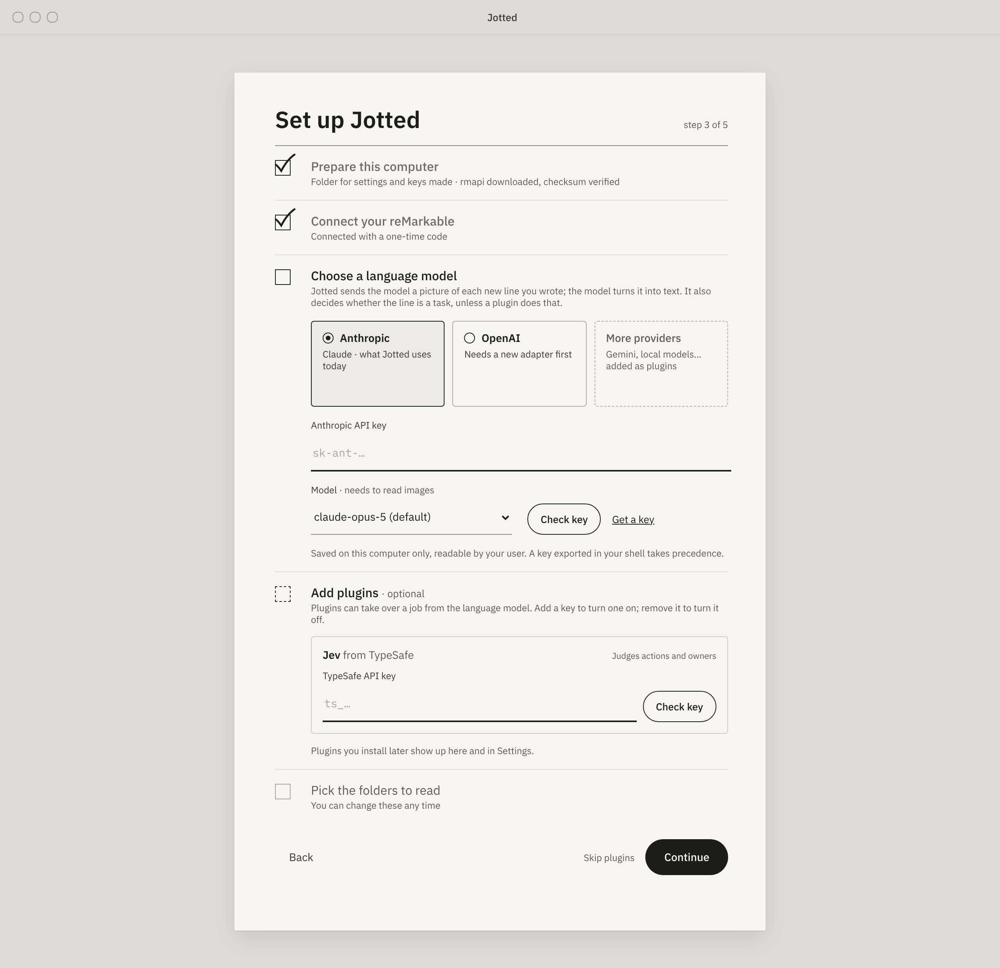
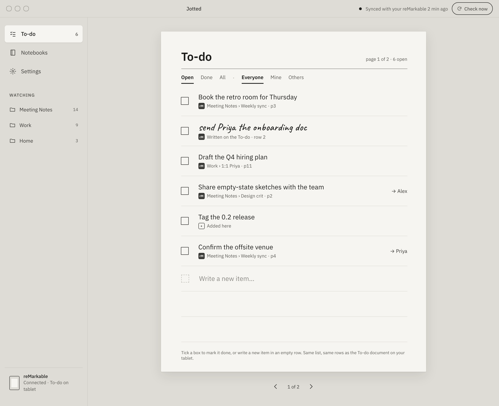
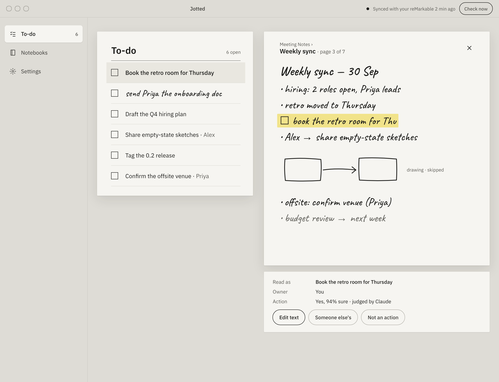
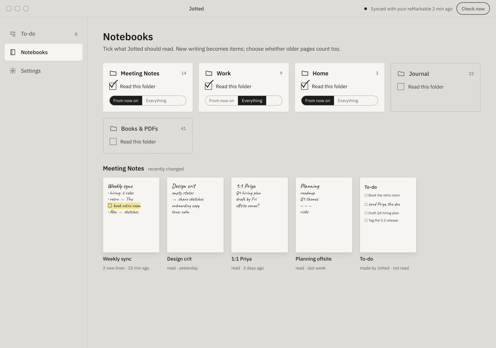
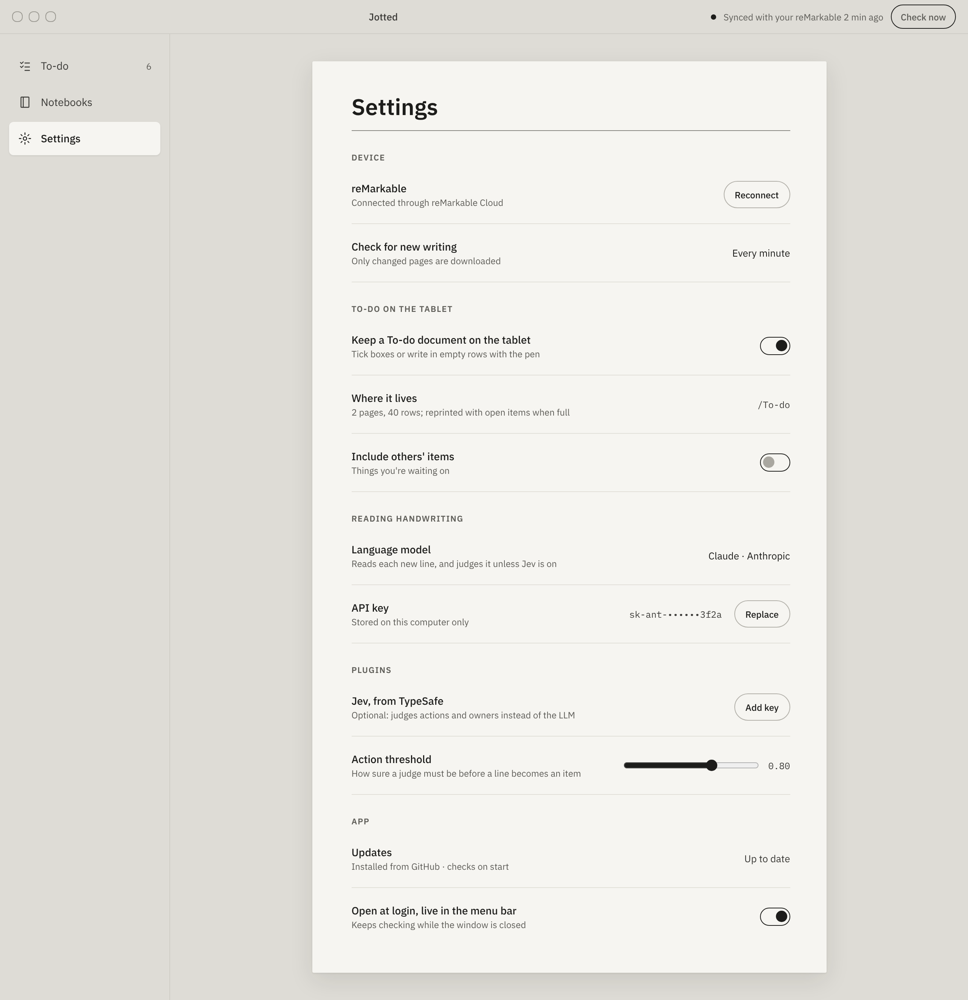
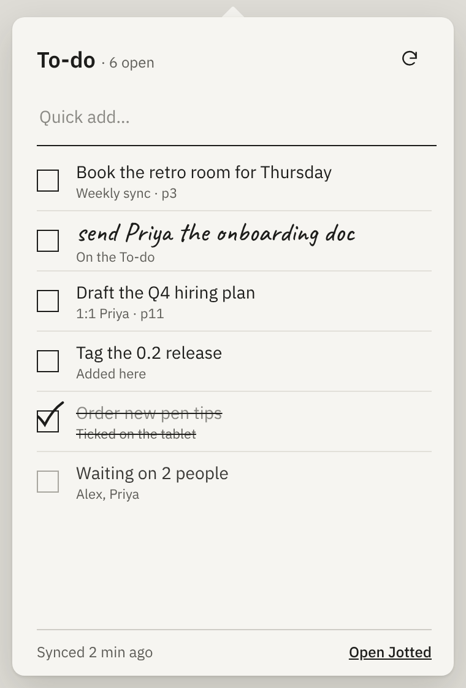

# Jotted desktop app — build spec

Oct 3, 2026 · @Sam · proposed

## Purpose

A desktop app for Jotted, Mac first and Windows later, that looks like paper on the tablet: one sheet with printed checkboxes, the same rows as the To-do document on the reMarkable, and your own ink where you wrote by hand.

The app is a wrapper around the `jotted` CLI from [`jotted-cli`](https://github.com/sameera207/jotted-cli). It runs `jotted --json …` and reads what it prints, nothing else. That repo's `docs/cli-contract.md` is the contract; this spec is about everything on this side of it.

- Designs: [`docs/mockups/`](../docs/mockups/README.md), one PNG and one static page per screen, linked from each screen below. Their source is the "Jotted desktop app" design canvas (https://claude.ai/artifact/41a9qePZqcgRrM9WPSL6wd), also kept in `docs/mockups/source/`.
- Contract: `vendor/jotted/cli-contract.md` and `vendor/jotted/schema.json`, copied from the pinned CLI release.

## Decisions

| Question | Decision |
| --- | --- |
| Shell | Tauri 2. Small, signs well, runs the CLI as a bundled sidecar, and builds for macOS and Windows |
| Front end | React + TypeScript + Vite. Plain CSS with design tokens; no UI kit, the paper look is custom |
| Talking to Jotted | Only `jotted --json …`, through a small Rust runner. The front end never spawns processes itself |
| Which `jotted` | A pinned release, bundled inside the app (`jotted.lock`), as the seed; newer releases are installed by the app itself (`specs/CLI-updates-spec.md`). `JOTTED_BIN` points at another build for development |
| Live updates | One `jotted events --follow` process, forwarded to the window as Tauri events. No polling |
| Speed | `jotted serve --no-browser --port 0` runs while the app runs, so each command is quick |
| Secrets | Keys and one-time codes go to `jotted` on stdin, through the runner. Never in arguments, logs or front-end state after submit |
| Ink | Always the real strokes, as SVG from `jotted image line` / `image page`. The handwriting font in the mockups is a stand-in |
| Theme | Light (e-ink paper) for v1. Dark is an open question |
| Platforms | macOS (Apple silicon and Intel) for v1; Windows after |
| Tests | A fake `jotted` that answers from outputs recorded from the real CLI, so the UI builds and tests with no tablet, key or Python |

## Architecture

```text
 ┌──────────────── jotted-app ────────────────────────────────┐
 │ React screens ── store ── jotted client (TS, typed from     │
 │                              schema.json)                   │
 │                                   │ invoke / listen          │
 │ Rust: runner (one-shot commands) · serve supervisor ·       │
 │       events follower · tray · autostart · updater          │
 └───────────────────────────────────┼─────────────────────────┘
                                     │ spawn, stdin, stdout (JSON)
                          bundled `jotted` (pinned release)
                                     │
                        reMarkable Cloud · Anthropic · TypeSafe
```

### Start-up

1. `jotted --json version`. If `contract` isn't one the app supports (v1 today), show "This version of Jotted needs updating" and stop.
2. `jotted --json setup status`. If `complete` is false: the Welcome screen on first launch, else straight to Setup.
3. Start the serve supervisor and the events follower.
4. Load the store: `items --status all`, `settings`, `ai`, `status`.
5. Show the To-do window (or only the tray, when launched at login).

On quit: stop the follower, SIGTERM the server, wait up to 5 s.

## The Rust side (`src-tauri/`)

### Runner

One Tauri command, `jotted(args: string[], stdin?: string) -> Envelope`:

- Adds `--json`, sets `JOTTED_BUNDLED=1`, and runs the bundled binary (or `JOTTED_BIN`).
- Allows only commands listed in `vendor/jotted/schema.json`, minus `serve`, `start`, `update`, `mcp`, `setup` (interactive) and `auth`. The front end can't run anything else.
- Writes `stdin` and closes it. Secrets never go in `args`; the runner rejects arguments that look like keys.
- Timeouts: 60 s by default; `check`, `collect`, `todo`, `connect`, `setup prepare` get 10 minutes.
- Parses stdout as the envelope. Empty or invalid output becomes `{ok: false, error: {code: "internal", message: …}}` with stderr attached for the debug log.
- Appends stderr to a rotating log in the app's log folder (without stdin).

### Serve supervisor

Runs `jotted serve --no-browser --port 0` once setup is complete. Restarts it with backoff (1 s, 5 s, 30 s) if it exits; after three fast failures, shows a banner and keeps running commands without it (they still work, just slower).

### Events follower

Runs `jotted events --follow --since <cursor>`, reading one JSON object per line and emitting each as the Tauri event `jotted://event`.

- Saves the last `cursor` in the app's data folder, and passes it back after a restart so nothing is missed.
- No saved cursor: starts without `--since` (from now) after the initial load.
- Restarts with backoff if it exits.

### Tray, autostart, updater

- Tray / menu bar icon with the open count as its title on macOS. Clicking it opens the tray popover window.
- Open at login through `tauri-plugin-autostart`, off by default and set in Settings.
- Closing the window keeps the app in the tray when "Keep running in the menu bar" is on (default on).
- App updates through `tauri-plugin-updater`, from this repo's GitHub releases. CLI releases are installed separately, by the app (`specs/CLI-updates-spec.md`).

## The front end (`src/`)

### Jotted client

- `src/jotted/types.gen.ts`: generated from `vendor/jotted/schema.json` (`scripts/gen-types.ts`). Never edited by hand.
- `src/jotted/client.ts`: one typed function per command the app uses (`items()`, `itemsDone(id)`, `connect(code, {replace})`, …), each calling the runner and returning `data` or throwing `JottedError` with `code`, `message`, `retry`, `step`.
- A test checks every command and option the client uses exists in the vendored schema.

### Errors

One handler, by `error.code` (never by message):

| Code | What the app does |
| --- | --- |
| `not_set_up` | Opens Setup at `error.step` |
| `busy` | Retries after 1, 2, 4 s; then shows "Your reMarkable is busy; try again in a moment" |
| `not_connected` | Banner: the message, with "Reconnect" (Setup's connect step with `--replace`) |
| `model_error` | Banner: the message, with "Check your key" (Settings › Reading handwriting) |
| `invalid`, `not_found`, `conflict` | Shows the message where the action was taken; undoes any optimistic change |
| `config`, `internal`, unknown | An error panel with the message and "Show log" |

### Store

One store (Zustand) holding `items` (every status), `settings`, `ai`, `status`, `setup` and sync state. Filters are applied in the front end.

Events update it:

| Event | Store change |
| --- | --- |
| `item.added`, `item.changed` | Upsert `item` by `id` |
| `item.removed` | Delete by `id` |
| `check.started` | Sync state: checking |
| `check.finished` | Sync state: idle; reload `status`; if `errors` > 0, show the last `source.error` |
| `todo.published` | Reload `status` |
| `settings.changed` | Replace `settings` |
| `source.error` | Banner with `message` |
| anything else | Ignored |

If the saved cursor is older than the week of events Jotted keeps, reload everything and carry on from the latest cursor.

Ticks, edits, adds and dismissals are optimistic: the store changes at once, the command runs, and an error undoes the change.

## Screens

Each screen links its mockup in `docs/mockups/` and lists the commands it runs and how it behaves.

### 1. Welcome



- First launch with setup incomplete.
- What you need: a reMarkable with cloud sync (Connect subscription), your reMarkable account (for the one-time code), an API key for a language model (Anthropic now, OpenAI once its adapter exists), and optionally a TypeSafe key for Jev.
- The ticks are only a checklist for the person; nothing is checked. "I have these. Set up" appears once the three required ones are ticked.
- The privacy note: Jotted runs on this computer, and images of new lines go to the model provider with the person's own key.
- No commands.

### 2. Setup





Driven by `setup status`, never a hard-coded list: the steps, their order, "step n of m", and which are optional all come from it.

1. On entering, run `setup prepare` (app folder, rmapi download), showing its steps as they finish.
2. Show the first step that isn't done. Known step IDs get their own screen; any other step gets a generic one (its `title`, a field when its `command` ends in `--stdin`, otherwise "Run `jotted <command>` in a terminal").
3. After each step, run `setup status` again and move on.

| Step | Screen | Commands |
| --- | --- | --- |
| `remarkable.connect` | One-time code (8 characters), Connect, "Get a code" (my.remarkable.com) | `connect --stdin`; on `conflict`, offer "Replace the connection" → `connect --stdin --replace` |
| `llm` | Provider cards from `ai.llm.providers`; key field labelled for the provider, "Get a key" from `ai.llm.key_url`; Model field (default `ai.llm.model`, free text, "needs to read images") | `ai provider NAME`, `ai model NAME`, `ai key llm --stdin` (checks the key with the provider) |
| `jev` (optional) | Plugin card: Jev, from TypeSafe, with its key field; "Skip plugins" | `ai key jev --stdin` |
| `folders` | A compact Notebooks picker: tick folders, "From now on" or "Everything" | `library`, `watch add PATH`, `watch from-now PATH` |

When `complete` is true, start the server and follower, run `check` once, and open the To-do window.

### 3. To-do window



The main window: sidebar (To-do with open count, Notebooks, Settings, Watching folders, device status), a title bar with sync status and "Check now", and the sheet.

- **Load:** `items --status all`. Re-rendered from the store as events arrive.
- **Filters:** Open / Done / All, and Everyone / Mine / Others (`owner`: `me` is Mine, `someone_else` is Others, `unclear` shows in Mine with a "?" mark).
- **A row:** checkbox, text, source line, owner.
  - Checkbox: `items done ID` / `items reopen ID`, drawn with a pen-stroke tick.
  - Text: the printed transcript (`text`). Items written by hand on the To-do document (`written: true`) show their ink instead, from `image line DOC ANCHOR`, because that's what the tablet shows. Ink SVGs are cached by `doc_id` + `anchor`.
  - Click the text to edit it inline: `items edit ID TEXT`. An item that was edited shows its new text.
  - Source line, from `origin` and `source`: "written here" (on the current To-do document), "written on an earlier To-do", "added in Jotted" (`web`), or "Folder › Document · p3", which opens "Where it came from".
  - Owner: someone else's items show "→ Someone else" (see CLI asks: owner names).
  - "×" on hover: `items dismiss ID` ("Not an action", or delete for one added here).
- **Empty row:** typing and Enter runs `items add TEXT`.
- **Pages:** when the To-do document is on (`settings.todo_enabled`), the sheet shows the document's pages: 20 rows each, items placed by `slot`, with "1 of 2" and page arrows. When it's off, one continuous sheet.
- **Sync status:** "Synced with your reMarkable 2 min ago" from `status.last_collected_at`; "Checking…" between `check.started` and `check.finished`.
- **Check now:** `check`.
- **Keyboard:** ↑/↓ move between rows, Space ticks, Enter edits, N focuses the empty row, ⌘R checks now.

### 4. Where it came from



Opened from a row's source line: the To-do sheet on the left with the row selected, the notebook page on the right.

- Page: `image page DOC PAGE --anchor ANCHOR`, which highlights the line. Header: folder › document, page n.
- "How Jotted read this line": the text, the owner, how sure the judge was (`p_action` as a percentage), and which judge (`ai.judge`: the LLM's label, or Jev).
- Actions: "Edit text" (`items edit`), "Not an action" (`items dismiss`). "Someone else's" waits for a CLI command (see CLI asks).
- Close returns to the list with the row still selected.

### 5. Notebooks



- `library`: folder cards (`folders`), each with "Read this folder" (`watch add` / `watch remove`) and, when read, "From now on" / "Everything" (`watch from-now` / `watch read-all`, shown from `settings.from_now`).
- Selecting a folder shows its documents (`documents` where `folder` matches) as thumbnails, from `image page DOC 1`, fetched lazily and cached in memory for the session. Only pages Jotted has read can be drawn (`not_found` otherwise), so unread documents show a blank sheet with their name.
- The To-do document is marked "made by Jotted · not read" (its folder and name match `status.todo`).

### 6. Settings



| Section | Shows | Commands |
| --- | --- | --- |
| Device | `status.source` (label, connected, detail); "Reconnect" | Setup's connect step with `--replace` |
| Checking | Every `settings.poll_interval_s` | `settings set poll_interval_s N` |
| To-do on the tablet | `todo_enabled`, where it lives (`todo_folder`/`todo_name`), `include_others` | `settings set …` |
| Reading handwriting | Provider and model (`ai.llm`), key hint (`ai.llm.key.hint`, or "from your shell" when `source` is `environment`); "Replace key", "Change model" | `ai provider`, `ai model`, `ai key llm --stdin` |
| Plugins | Jev: on or off, key hint; "Add key" / "Remove"; the action threshold slider | `ai key jev --stdin`, `ai remove jev`, `settings set action_threshold N` |
| App (app-owned) | Open at login; keep running in the menu bar; app version and Jotted version (`version`); "Check for updates" | Tauri autostart and updater |

### 7. Tray popover



- Open count, Check now (`check`), a quick-add field (`items add`), the first five open items (tick with `items done`), "Waiting on N" for others' items, last sync, "Open Jotted".
- A separate small window (380 × 560), positioned under the tray icon, closed when it loses focus.

## Visual design

Taken from the mockups. Tokens live in `src/styles/tokens.css`:

| Token | Value | Use |
| --- | --- | --- |
| `--desk` | `#DEDCD6` | Window background around the sheet |
| `--paper` | `#F6F5F1` | Sheets and cards |
| `--ink` | `#1D1D1B` | Text, checkboxes, ticks, primary buttons |
| `--pencil` | `#5E5D58` | Secondary text (4.5:1 on paper) |
| `--faint` | `#8A8984` | Done items, placeholders |
| `--rule` | `#E2E0D9` | Row rules |
| `--hairline` | `#8A8984` | The rule under a sheet's title |
| `--highlighter` | `#F1E38A` | The highlighted line in "Where it came from" |

- Type: IBM Plex Sans (UI and printed text) and IBM Plex Mono (keys, paths), bundled with the app (SIL OFL), not loaded from the web.
- Sheets: no radius beyond 2 px, a soft two-layer shadow, a 680 px maximum width, rows at least 60 px.
- Checkboxes: 18 px square, 1.5 px ink border; the tick is a pen stroke that overflows the box.
- No colour other than the highlighter. Status is shown with words and marks, never colour alone.
- Components: `Sheet`, `Row`, `Checkbox`, `FilterTabs`, `SourceLine`, `InkImage`, `PillButton`, `Switch`, `SecretField`, `CodeField`, `ProviderCard`, `Banner`.
- Accessibility: real buttons and inputs with labels, visible focus, everything reachable by keyboard, 44 px hit areas.
- Window: minimum 420 × 600; the sidebar collapses to icons below 760 px.

## Repo layout

```text
jotted-app/
  AGENTS.md, CLAUDE.md        how to work here, with the Jotted block from cli-contract.md ("In another repo")
  jotted.lock                 the pinned CLI release: version, contract, a SHA-256 per target
  vendor/jotted/              schema.json and cli-contract.md from that release
  scripts/
    fetch-jotted.ts           download the pinned builds and contract, check the checksums
    gen-types.ts              schema.json → src/jotted/types.gen.ts
    record-fixtures.sh        record the fake CLI's answers from a real CLI
  src/
    jotted/                   client.ts, types.gen.ts, errors.ts, events.ts
    store/                    the store and event handling
    screens/                  Welcome, Setup, Todo, SourcePeek, Notebooks, Settings, Tray
    components/               the components above
    styles/                   tokens.css, base.css, fonts
  src-tauri/
    src/                      main.rs, runner.rs, serve.rs, events.rs, tray.rs
    binaries/                 jotted-<target-triple> (fetched, not committed)
    tauri.conf.json           externalBin: binaries/jotted
  tests/
    fake-jotted/              a stand-in `jotted` that answers from fixtures
    fixtures/                 recorded outputs
    unit/                     Vitest
    e2e/                      Playwright
docs/mockups/                 the screens as PNGs and static pages, with the canvas source
specs/                        this spec
```

## Testing

- **Fake `jotted`:** a small Node script with the same command line as the commands the app uses. It answers from `tests/fixtures/`, keeps a little state (ticks, adds, edits, dismissals) and prints matching `events --follow` lines. Run the app against it with `JOTTED_BIN=tests/fake-jotted/jotted`.
- **Fixtures are recorded, never written by hand:** `scripts/record-fixtures.sh` runs the real pinned CLI with `JOTTED_HOME` set to a temporary folder and the CLI's own test setup (synthetic pages and fake rmapi), and saves each output. Re-record when the pin changes.
- **Unit (Vitest):** the client, the error handler, the store's event handling, source-line labels, slot-to-page layout, the schema check.
- **End to end (Playwright):** the front end in a browser with the runner replaced by the fake: first run, ticking, adding, editing, dismissing, filters, a busy retry, a `not_connected` banner, an expired cursor.
- **Nightly:** the main flows in the built app on macOS against the real pinned CLI and against `jotted-cli`'s `main`, to catch a contract break before release.

## Build, sign and release

- CI on GitHub Actions (macOS): fetch the pinned CLI builds → generate types → test → `tauri build` for `aarch64-apple-darwin` and `x86_64-apple-darwin` → sign (Developer ID) and notarize the app and the bundled `jotted` → publish a GitHub release with the updater manifest.
- Secrets in CI: the Apple certificate and notarization credentials, and the updater's signing key.
- Windows later: the same with the Windows CLI build and a code-signing certificate.

## What the app needs from `jotted-cli`

| Ask | For | Blocking? |
| --- | --- | --- |
| Standalone builds per OS on each release (stage 2 of the CLI spec), with checksums | Bundling the CLI | Only for packaging. Until then, development uses `JOTTED_BIN` pointing at a script that runs `uv run --project ../jotted-cli jotted "$@"` |
| Owner names on items (an additive `owner_name`) | "→ Alex" instead of "→ Someone else" | No |
| `items owner ID me\|someone_else` | "Someone else's" in Where it came from | No |
| `modified_at` and `pages` on `library` documents | Notebook cards ("edited 2 h ago · 7 pages") and caching thumbnails across sessions | No |
| `capacity` and page count in `status.todo` | The page arrows, without hard-coding 20 rows × 2 pages | No |
| Thumbnails for documents Jotted hasn't read (`image page` only draws pages it has read) | Thumbnails for every notebook | No |
| Class names on the highlight in `image page` SVGs | Styling the highlight from the app | No |
| Rename `jotted-desktop` to `jotted-app` in `AGENTS.md`, `docs/cli-contract.md` and the CLI spec | Consistent names | No |

Each is additive, so none needs a new contract version.

## Milestones

1. **Skeleton:** the repo, Tauri + React, the runner, the version check, `jotted.lock` and the vendored contract, generated types, the fake CLI, tokens and fonts.
2. **To-do, read only:** the store, the events follower, the serve supervisor, the To-do window with filters and sync status.
3. **Editing:** tick, add, edit, dismiss, Check now, optimistic updates, the error handler and banners.
4. **Setup:** Welcome, `setup prepare`, the step screens.
5. **Where it came from and Notebooks.**
6. **Settings and the tray:** autostart, keep running in the menu bar.
7. **Packaging:** signed, notarized macOS builds with the CLI inside, and app updates. Needs the CLI's release builds.
8. **Windows.**

## Open questions

- **Ink for every item?** Show the ink for every item that came from handwriting, not only rows written on the To-do document? It's closer to the paper, but costs an `image line` per row (cached).
- **Dark mode.** Keep e-ink light only, or add a dark "night paper" theme?
- **The browser web app.** Keep `jotted serve`'s web app for people without the desktop app, or retire it once this ships?
- **Paying for it.** Licence checks, trial and payments are out of scope here, but the updater and first run are where they would sit.
